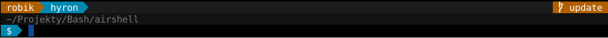

**AirShell** is a bash script that allows you to customise your terminal prompt (known as __`ps1`__).
With it you can make the prompt not only cleaner, but also have useful dynamic widgets shown with your prompt.
An example prompt may look as follows:

 
 

 
<small>(both are using default theme)</small>

### Installation


$ git clone http://github.com/robik/airshell
$ cd airshell
$ sh install.sh
# installation wizard will show up
